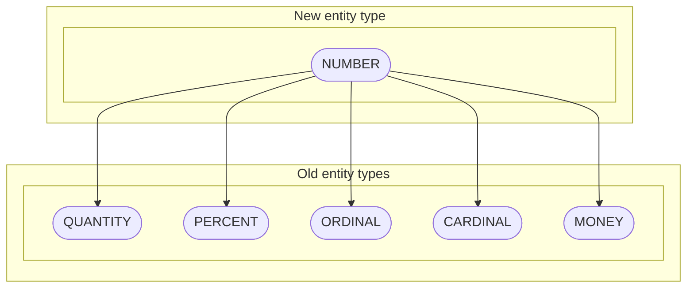
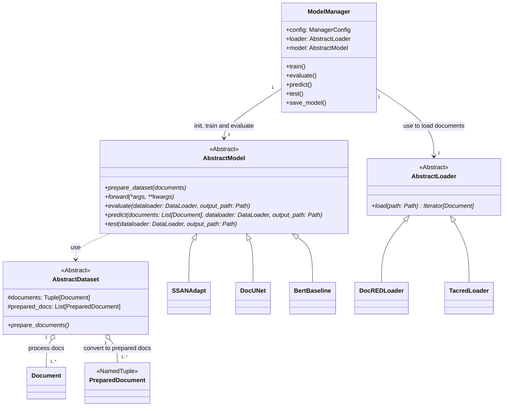
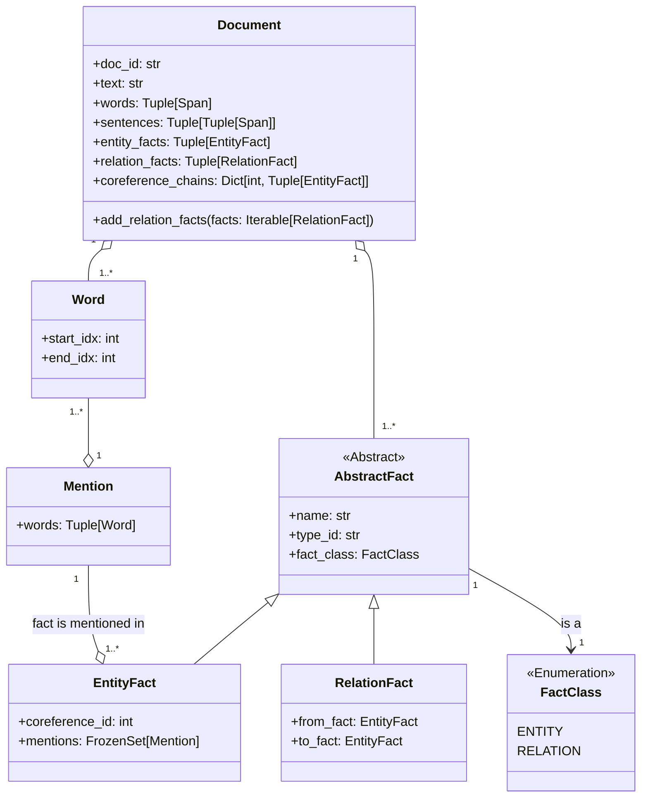

# Change of Relation Extraction's Entity Domain

Relation extraction (RE) is the task of discovering entities' relations in weakly structured text. There is a lot of
applications for RE such as knowledge-base population, question answering, summarization and so on. However, despite the
increasing number of studies, there is a lack of cross-domain evaluation researches. The purpose of this work is to
explore how models can be adapted to the changing types of entities.

## Motivation

There are several ways to deal with the changing types of entities:

1) Fine-tuning

    We can retrain our model on the new obtained data, but the main problem is to get and annotate new documents. For more details please 
    refer to following studies: 
    [Domain Adaptation for Relation Extraction with Domain Adversarial Neural Network](https://aclanthology.org/I17-2072) and
    [Instance Weighting for Domain Adaptation in NLP](https://citeseerx.ist.psu.edu/viewdoc/download?doi=10.1.1.149.8018&rep=rep1&type=pdf).

2) Ignoring

    Another way is to build a model that does not use any information of entities' types and just mark entities in the text with special
    tokens (e.g. [SUBJ] and [/SUBJ], [OBJ] and [/OBJ], etc.). For more details please refer to 
    [An Improved Baseline for Sentence-level Relation Extraction](https://arxiv.org/abs/2102.01373) and
    [A Generative Model for Relation Extraction and Classification](https://arxiv.org/abs/2202.13229).

3) Mapping

   Reasonable way is to build a mapping from the model's entity types to another domain ones. But there may be situations
   when it is impossible to build the unambiguous mapping (e.g. diagram below, where new type `NUMBER` correspond to 5 old ones).

   In the case of the unambiguous mapping, we can try all suitable mappings, but if there are $N$ entities and $M$
   candidates for each of them, $M^N$ model runs are required.

4) Diversified training

   The last method is called diversified training. Its key point is to change original entity types with the corresponding synonyms.

## Results

<table>
  <tr>
    <th rowspan="3">Adaptation methods</th>
    <th colspan="3">Results, F1-мера</th>
  </tr>
  <tr>
    <th colspan="2">DocRED</th>
    <th colspan="1">Re-TACRED</th>
  </tr>
  <tr>
    <th>SSAN-Adapt</th>
    <th>DocUNet</th>
    <th>BERT_base</th>
  </tr>
  <tr>
    <td>Ignoring</td>
    <td>54.32 &plusmn 0.05 </td>
    <td>-</td>
    <td> 76.28 &plusmn 0.18 </td>
  </tr>
  <tr>
    <td>Diversified training</td>
    <td>51.62 &plusmn 0.16 </td>
    <td>-</td>
    <td>74.56 &plusmn 0.83 </td>
  </tr>
</table>

## Class diagrams

The base classes are divided into 4 main categories:

* **_Examples' features_**:
  * Span
  * FactClass
  * AbstractFact
    * EntityFact
    * RelationFact
* **_Examples_**:
  * Document
  * PreparedDocument
  * AbstractDataset
* **_Models_**:
  * AbstractModel
* **_Utilities_**:
  * ModelManager
  * AbstractLoader

### Examples' features

## Run

### Dowload datasets

1) `bash scripts/download_datasets.sh`
2) In order to download original TACRED dataset visit [LDC TACRED webpage](https://catalog.ldc.upenn.edu/LDC2018T24).
   If you are an LDC member, the access will be free; otherwise, an access fee of $25 is needed.  In addition to the original version of 
   TACRED, we should also use the new label-corrected version of the TACRED dataset, which fixed a substantial portion of the dev/test 
   labels in the original release. For more details, see the [TACRED Revisited paper](https://arxiv.org/pdf/2004.14855.pdf) and their
   original [code base](https://github.com/DFKI-NLP/tacrev)

   After downloading and processing:
   * move tacred folder to `./etc/datasets` folder 
   * put all patched files in the `./etc/dataset/tacred/data/json` directory

### Build docker container
1) `cd path/to/project`
2) `docker build ./`
3) `docker run -it --gpus=all __image_id__ /bin/bash`

### Start training

`bash scripts/main.sh -c path/to/config -v __gpu_id__ -s __seed__ -o path/to/model/output/dir`
