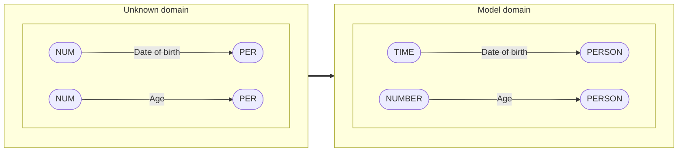

# Change of Relation Extraction's Entity Domain

Relation extraction (RE) is the task of discovering entities' relations in weakly structured text. There is a lot of applications for RE 
such as knowledge-base population, question answering, summarization and so on. However, despite the increasing number of studies, 
there is a lack of cross-domain evaluation researches. The purpose of this work is to explore how models can be adapted to the changing 
types of entities.

## Motivation
There are several ways to deal with changing entities' types
1) Ignoring (baseline)
   
    * Build a model that does not use any information of entities' types (get lower results)
    * Or don't pay any attention to the domain shift during inference (get lower results)
    
2) Mapping

4) Adopting
