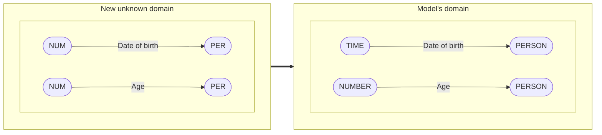
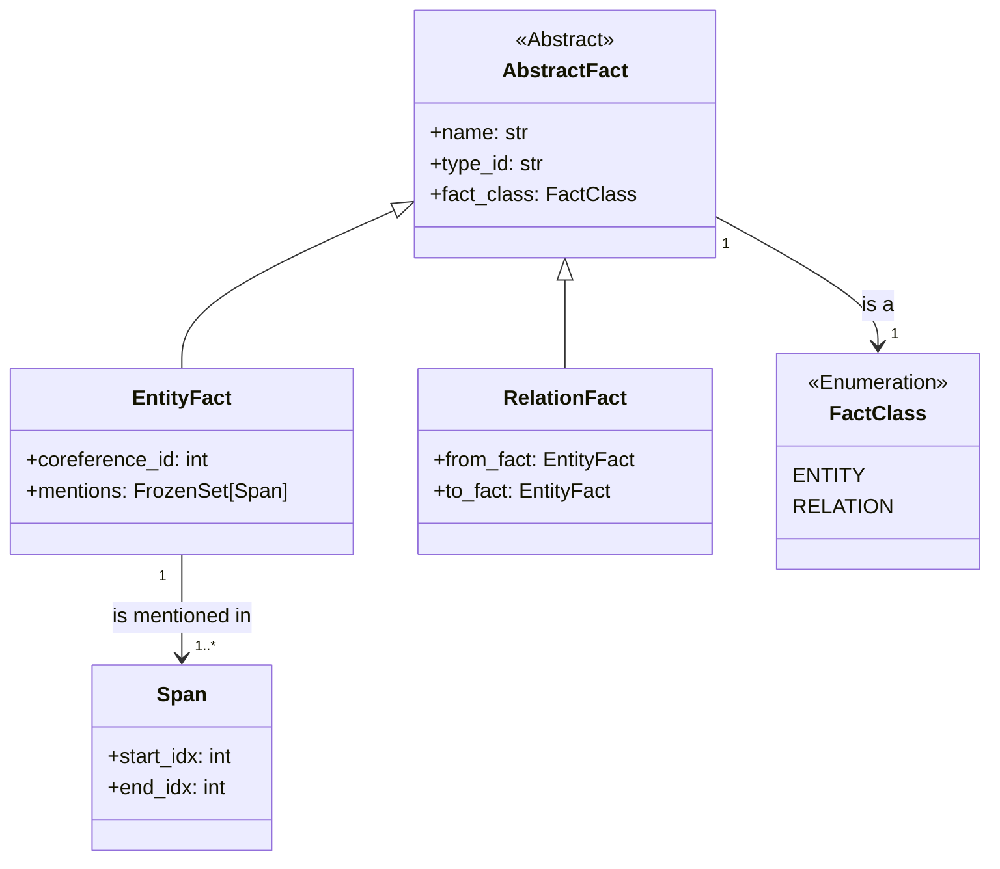
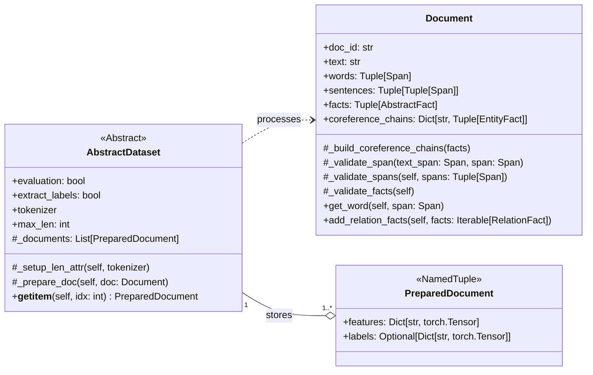
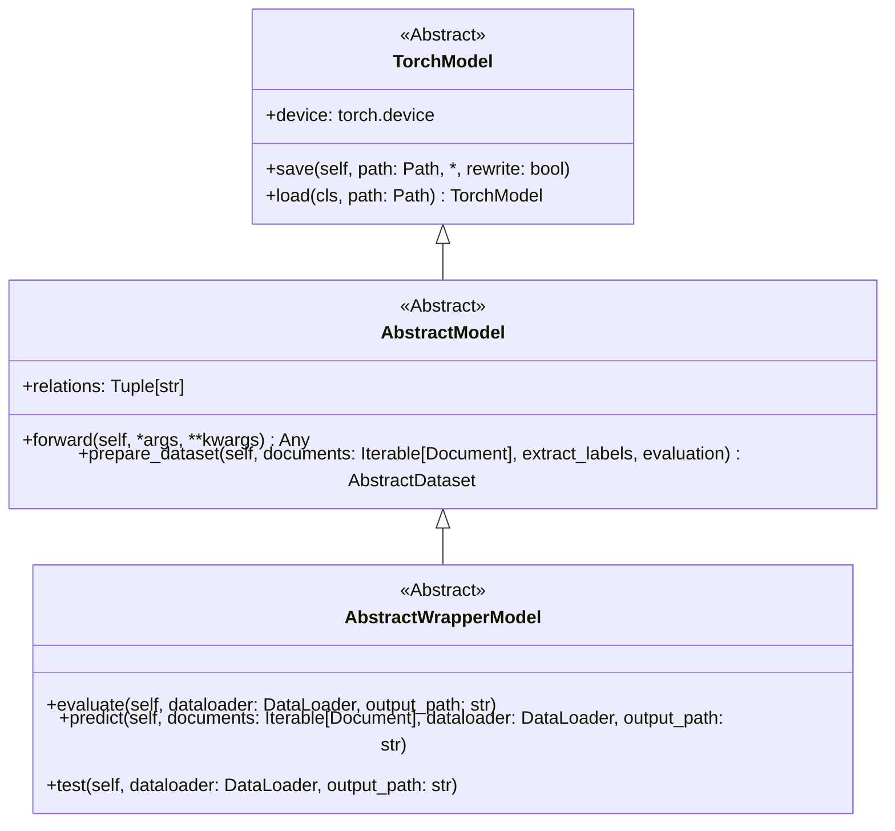

# Change of Relation Extraction's Entity Domain

Relation extraction (RE) is the task of discovering entities' relations in weakly structured text. There is a lot of
applications for RE such as knowledge-base population, question answering, summarization and so on. However, despite the
increasing number of studies, there is a lack of cross-domain evaluation researches. The purpose of this work is to
explore how models can be adapted to the changing types of entities.

## Motivation

There are several ways to deal with the changing types of entyties:

1) Fine-tuning

    We can retrain our model on the new obtained data, but the main problem is to get and annotate new documents

2) Ignoring

    * Build a model that does not use any information of entities' types;
    * Or don't pay any attention to the domain shift during inference.

3) Mapping

   Another way is to build a mapping from the model's entity types to another domain ones. But there may be situations
   when it is impossible to build the unambiguous mapping (e.g. diagram below, where `PER` correspond only to `PERSON`,
   but `NUM` is `NUMBER` and `TIME` concurrently).

   In the case of the unambiguous mapping, we can try all suitable mappings, but if there are $N$ entities and $M$
   candidates for each of them, $M^N$ model runs are required.

4) Diversified training

   We are going to develop training methods that instills domain shift resistance in RE models and allows them to adapt to
   new types of entities.

## Results

<table>
  <tr>
    <th rowspan="3">Adaptation methods</th>
    <th colspan="4">Results, F1-мера</th>
  </tr>
  <tr>
    <th colspan="2">DocRED</th>
    <th colspan="2">TACRED</th>
  </tr>
  <tr>
    <th>SSAN-Adapt</th>
    <th>DocUNet</th>
    <th>SSAN-Adapt</th>
    <th>DocUNet</th>
  </tr>
  <tr>
    <td>Ignoring</td>
    <td>53.60</td>
    <td>-</td>
    <td>-</td>
    <td>-</td>
  </tr>
  <tr>
    <td>Diversified training</td>
    <td>54.23</td>
    <td>-</td>
    <td>-</td>
    <td>-</td>
  </tr>
</table>

## Class diagrams

The base classes are divided into 3 main categories:

* **_Examples' features_**:
  * Span
  * FactClass
  * AbstractFact
    * EntityFact
    * RelationFact
* **_Examples_**:
  * Document
  * PreparedDocument
  * AbstractDataset
* **_Models_**:
  * TorchModel
  * AbstractModel
  * AbstractWrapperModel

And `ModelManager` class that is responsible for model training and scoring 

### Examples' features

### Examples

### Models

## Run

### Build docker container
1) `cd path/to/project`
2) `docker build ./`
3) `docker run -it --gpus=all __image_id__ /bin/bash`

### Dowload datasets

`bash scripts/download_datasets.sh`

### Start training

`bash scripts/main.sh -c path/to/config -v __gpu_id__`
