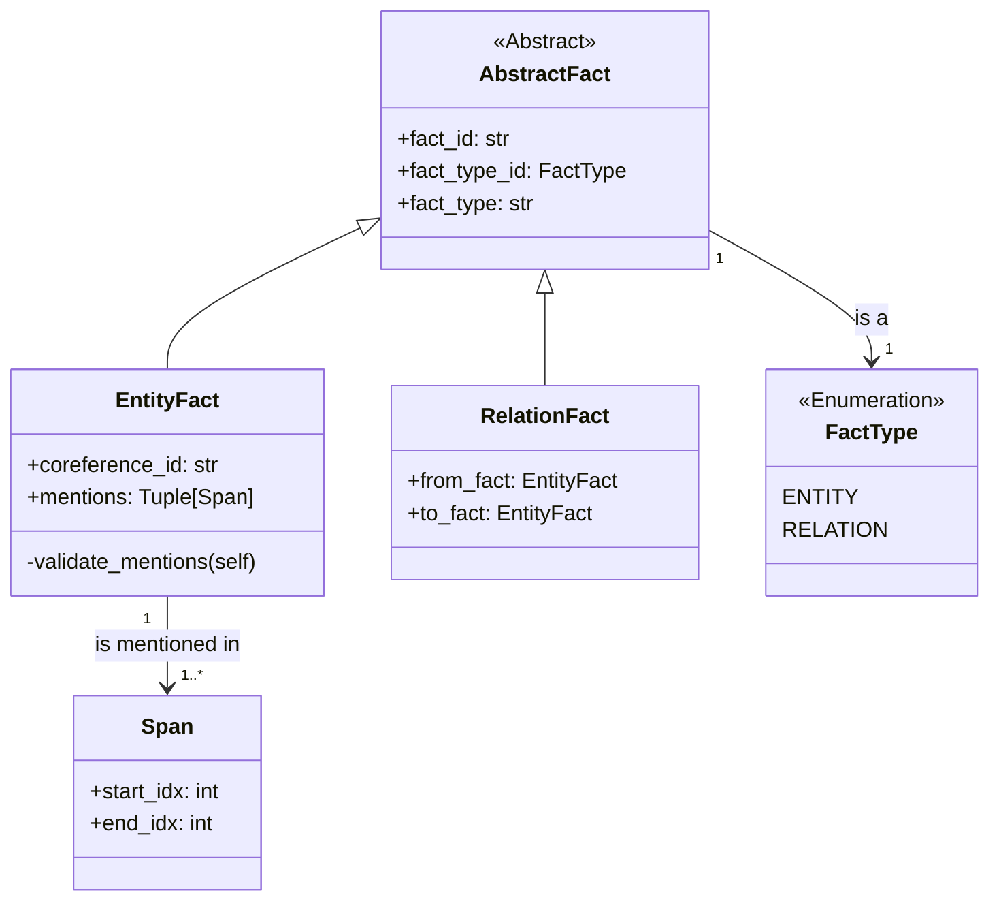
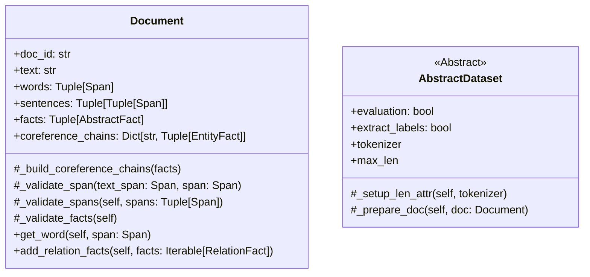

# Change of Relation Extraction's Entity Domain

Relation extraction (RE) is the task of discovering entities' relations in weakly structured text. There is a lot of
applications for RE such as knowledge-base population, question answering, summarization and so on. However, despite the
increasing number of studies, there is a lack of cross-domain evaluation researches. The purpose of this work is to
explore how models can be adapted to the changing types of entities.

## Motivation

There are several ways to deal with the changing types of entyties:

1) Ignoring (our baseline)

    * Build a model that does not use any information of entities' types (and get lower results);
    * Or don't pay any attention to the domain shift during inference (and also get lower results).

2) Mapping

   Another way is to build a mapping from the model's entity types to another domain ones. But there may be situations
   when it is impossible to build the unambiguous mapping (e.g. diagram below, where `PER` correspond only to `PERSON`,
   but `NUM` is `NUMBER` and `TIME` concurrently).

   In the case of the unambiguous mapping, we can try all suitable mappings, but if there are $N$ entities and $M$
   candidates for each of them, $M^N$ model runs are required.

3) Adapting

   We are going to develop training methods that instill domain shift resistance in RE models and allow them to adapt to
   new types of entities.

## Project structure

## Class diagrams

The base classes are divided into 3 main categories:

* **_Features_**:
  * Span
  * FactType
  * AbstractFact
    * EntityFact
    * RelationFact
  * CoreferenceChain
* **_Examples_**:
  * Document
  * AbstractDataset
* **_Models_**:
  * TorchModel
  * AbstractModel

### Features

### Examples

### Models

